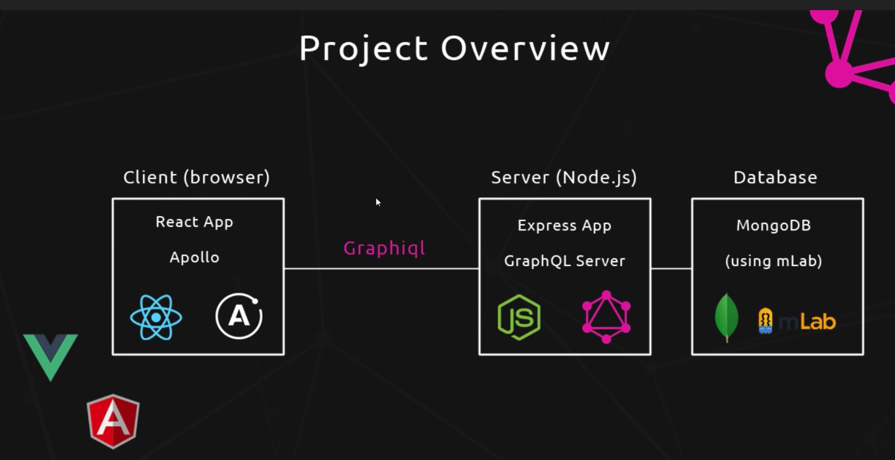
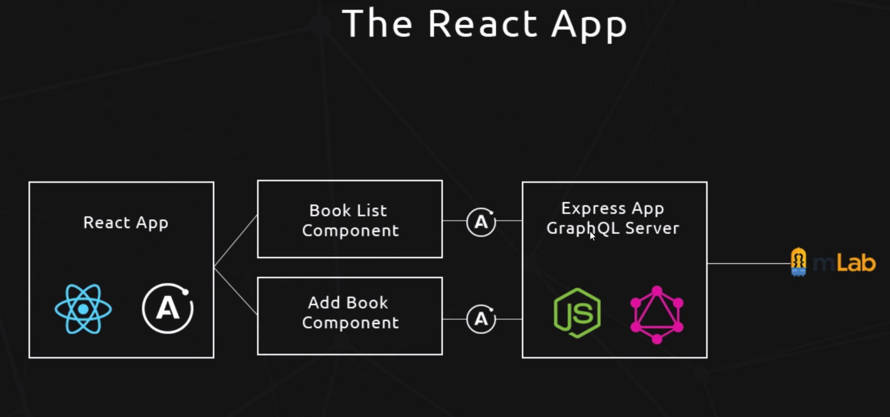

# GraphQL-Tutorial

## BACK END
1. The project aims to construct the Graph QL server using `node-js`

2. Query graphQL server from front end made using a `react` app.

3. The GraphQL server is created using `Express`

4. The project overview is like:



5. Install express as

 `npm install express`

 6. Create file called `app.js` in `server` directory. That is the starting point of graphql express server.

 7. Create file called `schema.js` in `schema` directory inside `server` directory. The schema of the queries is defined in it.

 8. The Dummy data in array in `schema.js` can be manipulated by package called `lodash` --> `npm install lodash`

 9. The `resolve()` function gets the data for a given query inside Root Query.

 10. The server can be run using `nodemon` 
        
        `npm install nodemon`

        `nodemon app`
        
The `GraphiQL` runs on the `http://localhost:4000/graphql`
and following query gets the result

```   
{
  author(id: 1){
    name
    age
  }
}
```

 11. Defining the relationship between Objects requires using the Object type as the field in other object i.e. COMPOSITION.
    For e.g. 
    In here the Objects `BookType` and `AuthorType` are linked by defining the respective fields inside of each others definition.
    In the Data ( Arrays ), the `books` contain `authorId` to define linkage.

  12. MongoDB database used from https://cloud.mongodb.com/user#/atlas/login

  13. `mongoose` is the npm ORM package to connect to MongoDB and interact with it.
      `npm install mongoose`
  
  14. Once the mongo db connection is made, the way to store data in MongoDB is through creating Object Models of our application.

  15. `server > models` contains the two files -> `book.js` & `author.js` that define the model of data defined inside our database.

  ## FRONT END


  1. GraphQL is not actually Javascript. So, to bind the GraphQL to Javascript framework `react`, a graphQL client called `Apollo` is used.

  2. A new `react` app can be created from facebook project -> https://github.com/facebook/create-react-app
      ```
      npm install create-react-app -g
      ```
3.  Create a new app inside project ``` create-react-app client ```
4. Inside the `client` directory, ``` npm start ``` will start the development server at http://localhost:3000/

5. Inside `client > src`, some modifications were made to simplify the front-end. A new `components` directory created that contains all the individual components. 

6. A component can be imported and used as tag inside any other JS file.
For. e.g Here, BookList.js component can be imported in App.js as
``` import BookList from './components/BookList'; ```
and used as
``` <BookList/> ```

 